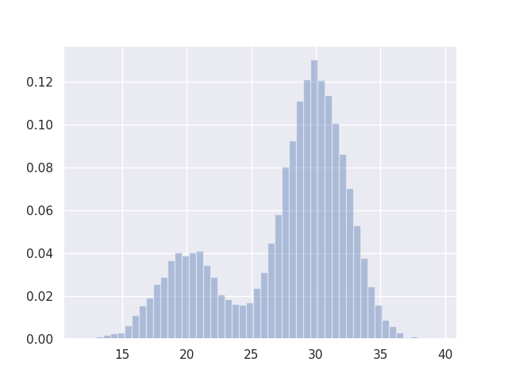

A python library for running Monte-Carlo analyses

## Usage

```python
import monte_carlo as mc

# Make some input random variables
a = mc.Norm(interval=(5, 10)) # 90% confidence interval
b = mc.Norm(interval=(5, 10), proportion = 0.95) # 95% CI
c = mc.Norm(mean=0, sd=1)
d = mc.Binom(p=0.75) # 75% chance of 1, 25% chance of 0
print(c.s) # single sample

# Make a stackup function that returns a single sample
def stackup():
    return a.s + b.s - c.s + 10 * d.s

sim = mc.Simulation(f=stackup)
sim.run()

```


